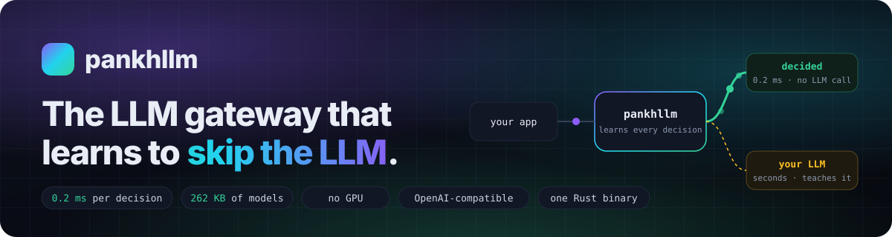

<p align="center"><a href="https://singhpratech.github.io/pankhllm/"></a></p>

[](https://singhpratech.github.io/pankhllm/)
[](https://theaivibe.org/blog/pankhllm-llm-gateway-learns-to-skip-the-llm)
[](https://github.com/singhpratech/pankhllm/actions/workflows/ci.yml)
[](https://github.com/singhpratech/pankhllm/blob/main/LICENSE)
[](https://www.rust-lang.org/)
[](https://singhpratech.github.io/pankhllm/#drop-in)
[](https://singhpratech.github.io/pankhllm/#numbers)
[](https://singhpratech.github.io/pankhllm/#numbers)
[](https://singhpratech.github.io/pankhllm/#numbers)
[](https://colab.research.google.com/github/singhpratech/pankhllm/blob/main/notebooks/train_pankhllm.ipynb)
[](https://singhpratech.github.io/pankhllm/#train)

[](https://singhpratech.github.io/pankhllm/#drop-in)
[](https://singhpratech.github.io/pankhllm/#drop-in)
[](https://singhpratech.github.io/pankhllm/#drop-in)
[](https://singhpratech.github.io/pankhllm/#drop-in)
[](https://singhpratech.github.io/pankhllm/#drop-in)
[](https://singhpratech.github.io/pankhllm/#drop-in)
<!-- After publishing, swap in live version badges:
[](https://crates.io/crates/pankhllm)
[](https://pypi.org/project/pankhllm/)
[](https://www.npmjs.com/package/pankhllm)
[](https://www.nuget.org/packages/Pankhllm)
[](https://pkg.go.dev/github.com/singhpratech/pankhllm/sdks/go)
-->

### The LLM gateway that learns to skip the LLM.

pankhllm started as an internal fix for LLM latency in production. Our agents kept paying a
large model, seconds and tokens at a time, for the same kinds of decisions: which tool, which
skill, which report, which parameters. The answers rarely changed. The bill and the wait did not.

So pankhllm sits where the app already calls an LLM and learns those recurring decisions
from the traffic. Once it has seen enough of a decision to prove it, it makes that decision
itself, in **0.2 ms on a CPU**, with no LLM call. Everything unfamiliar goes to the LLM you
already use, exactly as before, and becomes tomorrow's training data. Nothing else in the
stack moves: your models, your gateway, your agent framework all stay where they are.
One Rust binary. OpenAI-compatible. Change one base URL.

| Measured | |
|---|---|
| Same held-out questions, median answer | **1,743 ms → 4 ms**, 14 of 14 correct |
| One decision, in-process on a CPU | **0.2 ms** |
| 2,000 unseen pharma KPI questions | **63% answered with no LLM call, 0 wrong**; the rest go to the LLM |
| Model size, all decision models | **262 KB** |
| Train on 20,000 questions | **~1 second** on one CPU core |
| Server | **11 MB** binary, **17 MB** RAM idle, **1,750 req/s** on a laptop |

Every number comes from a run in this repository. How we measured, including where it's
weaker (96.5% precision on phrasing written by a different model), is in
[docs/BENCHMARK-DECISIONS.md](docs/BENCHMARK-DECISIONS.md) and [docs/JOURNAL.md](docs/JOURNAL.md).

**See it run** at [singhpratech.github.io/pankhllm](https://singhpratech.github.io/pankhllm/): a recorded race between an LLM planner and pankhllm's own model on the same questions.

**Read the launch article:** [pankhllm: the LLM gateway that learns to skip the LLM, without replacing the stack you already run](https://theaivibe.org/blog/pankhllm-llm-gateway-learns-to-skip-the-llm) on The AI Vibe.

**Drop it in.** Nothing in your agent changes:

```python
from openai import OpenAI
client = OpenAI(base_url="http://localhost:4000/v1", api_key="...")   # was: your LLM provider
```

The same one-line change works in LangChain, Semantic Kernel, Microsoft Agent Framework, the
Vercel AI SDK, and any OpenAI client in Python, TypeScript, JavaScript, C#, Go, Java, Rust, Ruby, PHP, C or C++.

**Teach it your domain in one command.** Give it your skill files, your prompts and your logs.
Pick the teacher: Claude, OpenAI, Azure OpenAI / AI Foundry, or a local Ollama model. You get
back a ready-to-run bundle:

```sh
python3 notebooks/run_trainer.py --skills ./skills --prompts agent.yaml --logs app.jsonl --teacher ollama
```

Or open [the notebook](notebooks/train_pankhllm.ipynb) in Colab. In Claude Code or OpenAI
Codex, say "train pankhllm on these files" and the bundled `pankhllm-train` skill runs it for you.

**What it isn't.** It isn't an LLM, and it doesn't replace yours. Explanations, judgement and
open-ended writing still go to your model, with faster routing, hedging, caching and budgets
around them. pankhllm removes the calls that never needed a model.

## How it works

Every agent turns one question into several model hops: load instructions, choose a tool,
write its arguments, read the result, write the answer. pankhllm answers each hop by the
cheapest lane that can prove its answer, and every lane fails open to the next:

| Lane | What answers | Latency | LLM calls |
|---|---|---|---|
| Cache | an identical question, same tenant and data version | ~1 ms | 0 |
| Learned route | a question shape seen before, with new entities or phrasing | ~1 ms + your tool | 0 |
| Rule | a pattern you pinned | ~1 ms + your tool | 0 |
| Decision | pankhllm's own model picks the operation, tool or skill and fills the parameters | 0.2 ms + your tool | 0 |
| Planner | a new question that maps to an operation in your catalog | one small-model call + your executor | 1 |
| Agent | explanation, judgement, open-ended work | the best eligible model, hedged and streamed | as needed |

**It learns from its own traffic.**

1. **Observe.** Every plan the planner makes that executes cleanly, every clean tool call
   and every explicit skill choice is recorded as a label. Only the question's shape is
   kept: codes, dates, numbers and quoted text become placeholders.
2. **Train.** `pankhllm mine --apply` retrains the decision models from those labels, holds
   out a fifth of the shapes, and picks the confidence threshold that meets your target
   precision. It takes about a second on a CPU.
3. **Decide.** At request time the model chooses only among operations the question fills
   exactly, and acts only when it is confident and the wording is familiar. Otherwise the
   question goes to the planner or the agent, exactly as before, and becomes the next label.

## The scorecard

Stars and architecture don't tell you whether this works in your stack. These numbers do,
and pankhllm produces every one of them from your own traffic:

| Metric | Where it comes from |
|---|---|
| p50, p95 and p99 latency, before and after | `decisions.mode: shadow` runs the model beside the planner without acting; the miner reports both |
| Share of requests that bypassed the LLM safely | `model_free_share` and per-lane counts in the miner report and `GET /v1/stats` |
| Precision of the bypassed decisions | decision calibration in the miner report; `pankhllm decide-eval` offline |
| Model calls eliminated and cost saved | per-lane model calls and `cost_usd` in the miner report |
| Behaviour under drift and failure | quarantine events in the heal log; unfamiliar wording falls back to the LLM by design |
| How fast coverage grows | labels per night and decided share per day, run to run |

What we can show today is benchmark and recorded runs on a fictional catalog: 63% of 2,000
held-out questions decided with none wrong, 61% at 96.5% precision on phrasing written by
another model, 1,743 ms to 4 ms on the same held-out questions. Production numbers belong
to production deployments; the shadow mode and the nightly report are how you get yours.

## Install

| Ecosystem | Command | What you get |
|---|---|---|
| Rust | `cargo install pankhllm` | the router |
| npm | `npx pankhllm serve` | the router, prebuilt per platform |
| npm | `npm install @pankhllm/client` | TypeScript and JavaScript client and executor |
| pip | `pip install pankhllm-server pankhllm` | the router, plus the Python client and executor |
| NuGet | `Pankhllm`, `Pankhllm.Server` | .NET client and executor; the router binary with `PankhllmServer.Start()` |
| Go | `go get github.com/singhpratech/pankhllm/sdks/go` | Go client and executor |
| Docker | `docker build -t pankhllm .` | the router |
| Source | `cargo build --release` | the router, at `target/release/pankhllm` |

```bash
export OPENAI_API_KEY=...                      # or ANTHROPIC_API_KEY, AZURE_OPENAI_API_KEY, none for Ollama
pankhllm check                                 # validate config, list models and prompts
pankhllm route "Why did the migration fail?"   # explain a routing decision, no model call
pankhllm serve --port 4000
```

Edit `pankhllm.yaml` to match your models. Prices are per million tokens; check them against your vendor.

## Call it from anything

pankhllm speaks the OpenAI chat-completions and Responses wire formats. Set `model` to `auto`
(or `auto/fast`, `auto/reasoning`, or a configured model name).

```bash
curl localhost:4000/v1/chat/completions -H 'content-type: application/json' -d '{
  "model": "auto",
  "messages": [{"role": "user", "content": "What is the refund window?"}],
  "pankhllm": {
    "context": [{"text": "Refunds within 30 days ...", "score": 0.91, "source": "policy.md"}],
    "tags": ["private"],
    "max_latency_ms": 8000,
    "prompt": "support-agent"
  }
}'
```

Clients that cannot add body fields send the same hints as headers: `X-Pankh-Tags`,
`X-Pankh-Prompt`, `X-Pankh-Tier`, `X-Pankh-Intent`, `X-Pankh-Max-Cost-Usd`,
`X-Pankh-Max-Latency-Ms`, `X-Pankh-Cache: bypass | refresh`.

| Endpoint | Purpose |
|---|---|
| `POST /v1/chat/completions` | answer; `"stream": true` for SSE |
| `POST /v1/responses` | the OpenAI Responses API shape, stateless |
| `POST /v1/route` | the routing decision only, no model call |
| `GET /v1/models`, `GET /v1/stats`, `GET /v1/routes`, `GET /v1/traces`, `GET /health` | introspection |
| `POST /v1/decisions/reload`, `POST /v1/learn`, `/v1/routes/export`, `/v1/routes/import` | operations |

Every response carries `pankhllm.model` (the lane and operation that answered), the
decision, its reasons and every attempt, so you can always see why a call went where it went.

**Clients.** Thin wrappers that add the `pankhllm` extras and typed results; the official
OpenAI client of your language works just as well.

| Language | Path | Notes |
|---|---|---|
| Python | `sdks/python` | httpx |
| TypeScript / JavaScript | `sdks/typescript` | fetch; Node 18+, Deno, Bun, browsers |
| C# / .NET | `sdks/csharp` | System.Net.Http; Semantic Kernel example in `examples/csharp` |
| Go | `sdks/go` | net/http only |
| Java | `sdks/java` | JDK 17 HTTP client, no dependencies |
| Rust | `sdks/rust` | reqwest, async |
| Ruby | `sdks/ruby` | net/http |
| PHP | `sdks/php` | ext-curl |
| C | `sdks/c` | libcurl |
| C++ | `sdks/cpp` | header-only over libcurl |
| Shell | `sdks/curl/pankh.sh` | curl, optional jq |

## Decisions: pankhllm's own model

```yaml
decisions:
  engine: native              # pankhllm's own model (default); or external for a /v1/systemone service
  models_file: models.json    # optional: models exported with `pankhllm export-models`
  mode: act                   # or shadow: compare against the planner without acting
  planner: true               # decide catalog operations
  tools: false                # opt in: decide agent tool-selection turns too
  min_confidence: 0.85        # to say "nothing fits" and skip the planner
  consensus_confidence: 0.55  # floor when the structure already agrees; the miner may raise it
  min_known_words: 0.7        # unfamiliar wording goes to the planner
```

The model is a hashed word-and-bigram logistic regression over the question's shape:
12,545 weights for a seven-operation catalog, 262 KB for every model together, no GPU.
Precision comes from what surrounds it. The slot filler first works out which operations
the question fills exactly, using every code, date and number it contains; the model chooses
only among those plus "unsupported"; a vote for an operation the question does not fit, or
for "unsupported" when something does fit, is sent to the planner instead; so is unfamiliar
wording. Parameters are then filled deterministically: enum values the question names,
patterned codes and dates, numbers in range, the one remaining entity. Two candidates for a
slot, or none, is a planner question, never a guess.

Measured on a pharma KPI catalog with seven operations, held-out questions, release build:

| Test set | Decided without an LLM | Precision |
|---|---|---|
| 2,000 template questions | 63% | 100% |
| 82 questions written by a model | 67% | 100% |
| 184 more, from a second model run | 61% | 96.5% |

Everything not decided went to the planner. Steps and full tables:
[docs/BENCHMARK-DECISIONS.md](docs/BENCHMARK-DECISIONS.md), [docs/JOURNAL.md](docs/JOURNAL.md).
Training on your own skills, prompts and logs, with any teacher: [docs/TRAINING.md](docs/TRAINING.md).
Public datasets that are legal to train on: [docs/DATASETS.md](docs/DATASETS.md).

## The planner lane

The model reads, your executor runs, the router checks. Declare a catalog of operations
with typed parameters:

```yaml
planner:
  enabled: true
  model: small                      # a fast model, routable: false
  executor: { url: "http://127.0.0.1:7000/execute", timeout_ms: 2000 }
  operations:
    - name: metric_by_period
      description: One metric for one entity in one month.
      examples: [calls for T-112 in 2025-07]
      params:
        metric: { type: enum, values: [calls, revenue, tickets], aliases: { calls: [call activity, visits] } }
        entity: { type: string, pattern: '[TDR]-\d{1,3}', description: territory like T-123 }
        period: { type: string, pattern: '\d{4}-\d{2}', description: month as YYYY-MM }
      answer_template: "{{params.entity}} {{params.metric}} in {{params.period}}: {{value|N0}}"
```

One structured-output call returns a plan or `UNSUPPORTED`. The router rejects any plan
with an unknown operation or parameter, a wrong type, a value outside an enum, pattern or
range, or control syntax in a string. A valid plan is POSTed to your executor with the
user's identity for row-level scope; the executor returns data and the router renders the
answer. The executor is one HTTP endpoint in any language, with helpers for Python,
TypeScript, C# and Go. The router never builds a query itself.

## Skills that route themselves

Put skill markdown and agent YAML in `prompts/`. A `pankhllm:` block in the front matter
declares tier, tags, budgets or a pinned model, plus how the skill is chosen:

```markdown
---
pankhllm:
  tier: fast
  tags: [private]
  triggers: [call activity, trx, nrx]
  examples:
    - how is my territory doing against my peers this quarter
    - which doctors in D-12 stopped writing last month
---
# Field KPI skill
Answer from the retrieved KPI extracts only ...
```

With `prompts.auto_select`, each request gets the `always` skills plus the skills whose
triggers match. When no trigger matches, the skill-routing model picks one; it is seeded by
`examples:` and learns from every request that names a skill. Fifty skill files cost the
same per request as three, the stable block is byte-identical across calls so provider-side
prompt caching hits, and turns served without a model send no prompt at all.

Agent loops have phases: tool selection is routed to `agent_loop.tool_select` (default
fast), the turn after tool results to `agent_loop.after_tool_result` (default balanced). A
cheap model that answers a hard question directly instead of calling a tool is penalised, so
it escalates rather than bluffs.

## Zero-model paths for everything else

- **Learned routes.** The router watches the planning model's tool calls, abstracts the
  question's entities into typed slots, and stores the shape with the argument template.
  The next question of that shape gets its tool call filled by the router. Only flat typed
  arguments are ever learned, never code, SQL or query strings, and only from turns that
  ended with one tool call and a clean result, twice. `pankhllm warm log.jsonl` trains this
  from your history before go-live.
- **Speculative answer templates.** On the tool-selection hop the model also writes a
  template for the final answer; when the result comes back the router renders it. With a
  learned route, a whole two-hop turn completes with zero model calls.
- **Response cache.** Exact hits in about a millisecond; with an embedding model,
  paraphrases too. Partition by `cache_key` (data version, tenant, scope) and bump it to
  invalidate. Identical concurrent requests cost one model call.
- **Rules.** A pattern with `respond_with_tool` answers a tool-selection turn with the tool
  call itself, arguments filled from named captures.

```yaml
cache: { enabled: true, ttl_secs: 604800, scope: question_only, semantic: { embedding_model: embed, threshold: 0.95 } }
routing:
  learned_routes: { enabled: true, min_similarity: 0.93 }
  speculative_answer: { enabled: true }
  rules:
    - { name: alerts, any: ["alert", "anomal"], tier: reasoning }
    - name: kpi-direct
      pattern: '(?i)call activity for (?P<territory>T-\d{3}) for (?P<month>\d{4}-\d{2})'
      respond_with_tool: { name: get_call_activity, arguments: { territory: "{{territory}}", month: "{{month}}" } }
```

A worked setup for a tool-using agent: [docs/RECIPE-AGENTS.md](docs/RECIPE-AGENTS.md).

## Routing the calls that remain

| Signal | Effect |
|---|---|
| Intent (lookup, extraction, summary, synthesis, reasoning, multi-hop, code) | picks a tier: `fast`, `balanced`, `reasoning`, and the grounding instruction |
| Agent-loop phase | tool selection to the fast tier, synthesis to the balanced tier |
| Retrieval quality (top chunk score) | weak retrieval escalates a tier, or abstains |
| Context size | drops models whose window is too small |
| Tags (`private`, `eu`, ...) | only models carrying every tag are eligible |
| Cost and latency budgets, per request and per user | drops, cuts or sheds before they are exceeded |
| Answer quality | refusals, empty, hedged and low-confidence answers escalate; an optional verifier model grades borderline answers |

Latency controls: `timeout_secs` and `max_concurrency` per model, `max_latency_ms` per
request, `hedge.after_ms` to race a second model, `server.max_in_flight` and
`server.request_timeout_ms` to shed load with an immediate 503. Streaming hedges until the
first token, then commits; tool calls stream token by token. A question too vague to answer
well gets one clarifying question instead of a guess (`confidence.on_ambiguous: clarify`).

| Provider `kind` | Notes |
|---|---|
| `anthropic` | Messages API; adaptive thinking, optional `effort`, stable system block cache-marked |
| `openai` | OpenAI and anything speaking its API: Ollama, vLLM, LM Studio, Groq, Together, OpenRouter |
| `azure` | Azure OpenAI and Azure AI Foundry deployments; `model` is the deployment name |

Tool calling, structured output and streaming pass through on both surfaces, translated
for Anthropic and for upstreams that only speak the Responses API.

## Logging and the miner

```yaml
store: { path: ./state/pankhllm.db, redact_questions: true, retention_days: 30 }
heal: { quarantine_after_failures: 2, autotune: true }
```

Every request is written to an embedded SQLite database off the hot path: lane, model,
shape, intent, tier, phase, tool, latency, tokens, cost, confidence and outcome. User ids
are hashed; question text can be redacted; code-like tool arguments are never stored.
`pankhllm mine --since-hours 24 --apply --report reports/nightly.md` retrains the decision
models, learns routes the live path missed, quarantines failing ones, measures every lane
and model, and proposes vocabulary and timeouts. Set `server.cors_origins` to call the API
from a browser page, and `server.api_keys_env` to require inbound keys.

## Testing, docs and layout

```bash
cargo test                                                        # 117 tests, no network
cargo clippy --all-targets -- -D warnings
pankhllm --config evals/pharma-kpi/router.yaml decide-eval test.jsonl   # decision precision, offline
pankhllm --config evals/pharma.yaml eval evals/pharma-10k.jsonl         # routing accuracy, offline
```

| Doc | What it covers |
|---|---|
| [docs/TRAINING.md](docs/TRAINING.md) | train on skills, prompts and logs; teachers; resource needs |
| [docs/BENCHMARK-DECISIONS.md](docs/BENCHMARK-DECISIONS.md) | every number, how it was measured, where it is weaker |
| [docs/JOURNAL.md](docs/JOURNAL.md) | each step taken and what it changed |
| [docs/DATASETS.md](docs/DATASETS.md) | public data and question sets, with licenses |
| [docs/RECIPE-AGENTS.md](docs/RECIPE-AGENTS.md) | a tool-using agent behind pankhllm |
| [docs/PRODUCTION.md](docs/PRODUCTION.md), [docs/DEPLOY.md](docs/DEPLOY.md) | latency numbers, gaps, Linux, Windows and Docker deployment |
| [docs/EVALUATION.md](docs/EVALUATION.md) | what each test layer checks |

```
src/router.rs       lanes, decisions, cascade, hedging, budgets, tracing
src/native.rs       pankhllm's own decision model: features, training, held-out thresholds
src/slots.rs        slot filler: enums, aliases, patterns, numbers, structural fit
src/planner.rs      planner lane: catalog, schema, validation, executor, rendering
src/learn.rs        learned routes: typed shapes, fill, feedback, quarantine
src/prompts.rs      skill registry: front matter, triggers, examples
src/cache.rs        exact and semantic response cache
src/store.rs        embedded trace database with a non-blocking writer
src/miner.rs        overnight miner and autotune
src/classifier.rs   intent heuristics
src/signals.rs      tokens, retrieval quality, ambiguity, agent-loop phase
src/providers/      anthropic, openai (chat or Responses; Azure; Ollama, vLLM, ...), SSE
src/server.rs       chat-completions and Responses surfaces, auth, CORS, shedding
notebooks/          the trainer notebook and its one-command runner
site/               the project page
```

## Prior art, and what is ours

**What pankhllm ships that is its own.** The decision models are pankhllm's: hashed-feature
linear classifiers over a question's shape, trained by the router itself from the
generative planner's decisions (the teacher), stored in a 262 KB file, deciding in about
0.2 ms on a CPU. The structural constraint around them is also ours: before any model
votes, the slot filler works out which operations the question can satisfy exactly, the
model chooses only among those, and a vote for an operation the question does not fit is
sent to the teacher instead. So are the learned routes and speculative answer templates,
the caller-owned executor contract, the trace store and overnight miner, and the
skill-routing model that learns from skill files and logs.

**What pankhllm does not ship.** It has no LLM. Generation, and every decision it is not
sure about, go to whatever models you configure.

**Ideas and interfaces we build on, with credit:**

- **Typed, non-autoregressive "System 1" decisions** as a product category come from
  [Jev](https://www.langchain.com/blog/building-a-harness-with-jev) by TypeSafe AI and
  [Laya](https://github.com/NandhaKishorM/laya) by Convai Innovations (Apache 2.0). pankhllm
  can use either as an external decision engine over their `/v1/systemone` interface
  (`decisions.engine: external`). We benchmarked against Laya; the structural constraint took
  it from 8 of 14 zero-shot to 8 of 10 answerable questions accepted with none wrong. The
  default engine is pankhllm's own model, which needs neither.
- **Routing across providers** is the category [LiteLLM](https://github.com/BerriAI/litellm)
  defined. The wire format is OpenAI's.
- **Trusted publishing, prompt caching and structured outputs** are the registries' and
  providers' features; pankhllm just uses them.

## Roadmap

- Shared state (cache, learned routes, decision models) across instances behind a load balancer
- Racing the planner against the agent for questions near the planner's edge
- A review page for the miner's proposals
- Trained checkpoints for Laya or Jev from the miner's exported decisions

## License

MIT. Product and company names in the examples are fictional.
